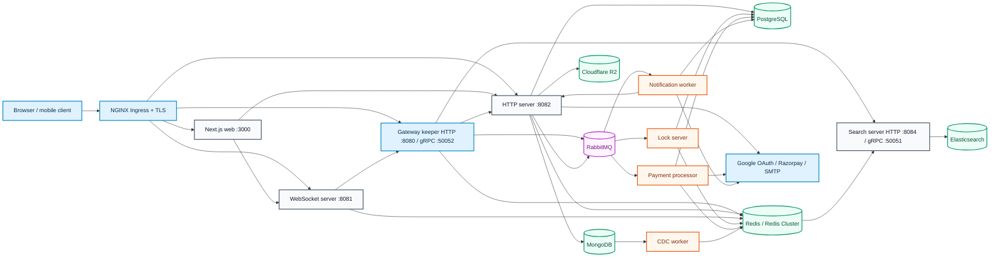
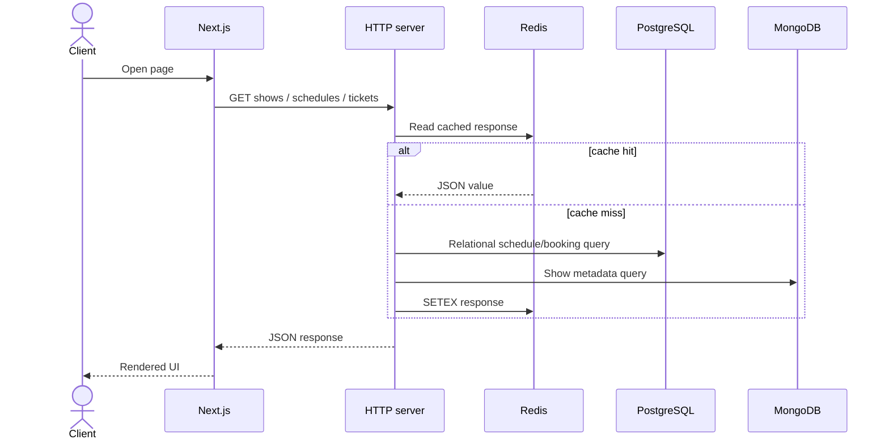
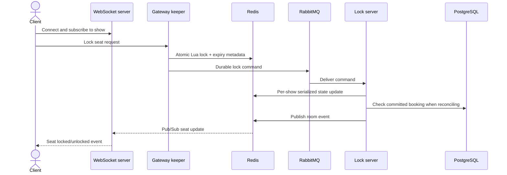
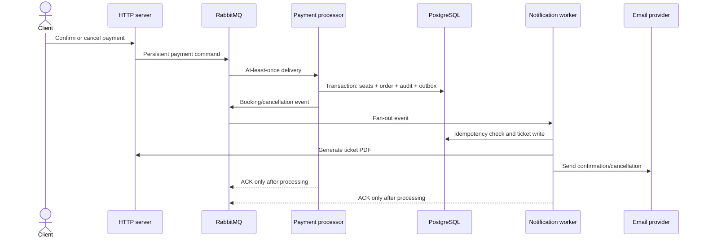
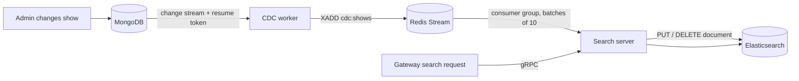
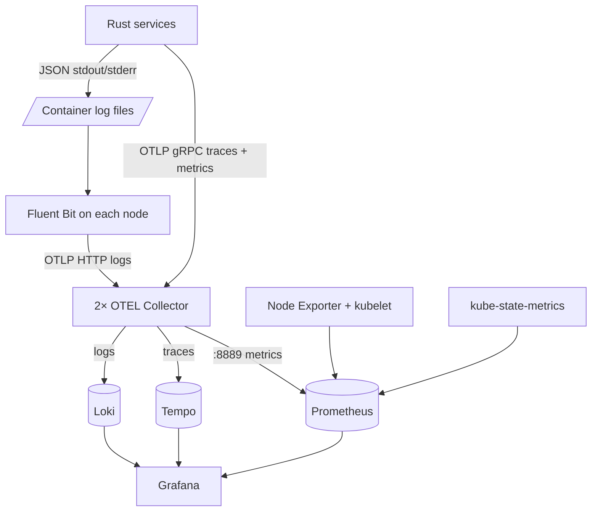

# Bookit

Bookit is a distributed booking platform built as a Rust and Next.js monorepo.
It separates synchronous API traffic, real-time seat coordination, search,
payments, notifications, and change-data propagation so each workload can be
scaled and recovered independently.

This document describes what is implemented in this repository and the matching
GitOps repository at [`bookit-k8s`](bookit-k8s/README.md). Capacity figures below
are configuration-derived ceilings or sizing formulas, not benchmark claims.

## Architecture at a glance



The drawing is intentionally “whiteboard-like”: boxes are independently
deployable processes, cylinders are stateful systems, and arrows show network
or event dependencies. Argo CD and CI/CD control deployments but are not in the
runtime request path.

## Server responsibilities

| Component | Protocol / port | Responsibility | Stateful dependencies | Kubernetes scaling |
|---|---|---|---|---|
| `web` | HTTP `3000` | Next.js user and admin UI | API, WebSocket, public object storage | 1–5 pods, CPU target 75% |
| `gateway-keeper` | HTTP `8080`, gRPC `50052` | Edge routing, seat coordination, circuit breaking and gRPC locking | Redis, RabbitMQ, HTTP API, search | 1–5 pods, CPU target 75% |
| `http-server` | HTTP `8082` | Authentication, admin APIs, schedules, booking, tickets, uploads and payments | PostgreSQL, MongoDB, Redis, RabbitMQ, R2 | 1–5 pods, CPU target 75% |
| `ws-server` | WebSocket `8081` | Client sessions and real-time seat-event fan-out | Redis Pub/Sub, gateway gRPC | 1–5 pods, CPU target 75% |
| `search-server` | HTTP health `8084`, gRPC `50051` | Search API and Elasticsearch synchronization | Elasticsearch, MongoDB, PostgreSQL, Redis Stream | 1–5 pods, CPU target 75% |
| `lock-server` | RabbitMQ consumer | Serializes seat state per show and reconciles expired locks | RabbitMQ, Redis, PostgreSQL | 1–5 pods, CPU target 75%; 10 tasks/pod by default |
| `payment-processor` | RabbitMQ consumer | Completes/cancels orders, records audit/outbox events and publishes booking events | RabbitMQ, PostgreSQL, Redis, Razorpay | 1–5 pods, CPU target 75%; one consumer loop/pod |
| `notification-worker` | RabbitMQ consumer | Creates ticket records/PDF requests and sends booking email | RabbitMQ, PostgreSQL, HTTP API, Gmail/SMTP | 1–5 pods, CPU target 75%; one consumer loop/pod |
| `cdc-worker` | Mongo change stream + Redis Stream | Moves show changes from MongoDB into the search update stream | MongoDB, Redis | Source exists; no active base Kubernetes workload yet |

The ingress currently routes public API traffic directly to `http-server`,
WebSocket traffic to `ws-server`, web traffic to `web`, and public gRPC traffic
to `gateway-keeper`. If the gateway is intended to enforce policy for every HTTP
request, the ingress must route the API hostname through it instead.

### Known deployment gaps

The diagrams describe the intended runtime relationships, but the following
checked-in mismatches must be fixed before treating the Kubernetes deployment as
operational:

| Gap | Current state | Impact |
|---|---|---|
| HTTP API port | Rust binds `8082`; Deployment and Service target `3002` | Ingress and health traffic cannot reach the process |
| WebSocket port | Rust binds `8081`; Deployment and Service target `8080` | WebSocket ingress cannot reach the process |
| Search discovery | Search starts gRPC on `50051`, but its manifest has no container port or Service | Gateway cannot resolve/reach `search-server:50051` through Kubernetes DNS |
| CDC deployment | `cdc-worker` source and Docker build exist, but it is absent from `apps/base` | MongoDB changes do not reach Redis Stream unless run outside this base |
| Gateway enforcement | Public API ingress points directly to `http-server` | Gateway authentication, routing or circuit-break policies do not cover those requests |
| Health probes | Application Deployments do not define readiness/startup/liveness probes | Kubernetes can route traffic before dependencies are usable and detect deadlocks slowly |

Resolve the port mismatches by making each process read the checked-in port
configuration or by changing the Services to the hard-coded runtime ports. Add
a headless or ClusterIP search Service and a CDC Deployment before enabling
their dependent flows. These are correctness issues, not tuning improvements.

## Core request and event flows

### Read path



Redis reduces repeat reads, but PostgreSQL remains authoritative for relational
booking and payment state. Cache invalidation must follow writes; stale cache
data must never authorize a booking or payment transition.

### Seat lock and real-time path



Redis Lua scripts provide atomic updates for lock keys, sorted sets, and seat
bitmaps. The lock server uses per-show actors plus a global semaphore, which
limits concurrent work while preserving ordering for a show. A database unique
constraint or transactional check must remain the final booking authority;
Redis leases alone cannot prove ownership after expiry or failover.

### Payment and notification path



RabbitMQ delivery is at least once, so every handler must be idempotent. Payment
provider IDs, payment request IDs, order IDs and outbox IDs should have database
uniqueness constraints. Consumers must acknowledge only after durable effects
are committed and should route poison messages to bounded dead-letter queues.

### Search synchronization path



The CDC worker stores its MongoDB resume token in Redis. Search reads up to ten
stream records per blocking call and acknowledges after handling. Production
should give each search replica a unique consumer name, reclaim abandoned
pending entries, monitor consumer-group lag, and make index updates idempotent.

## Deployment topology

Each environment is rendered from Kustomize:

```text
bookit-k8s/apps/base
        │
        ├── apps/overlays/dev  ── apps/regions/dev/us-east
        │
        └── apps/overlays/prod ──┬── apps/regions/prod/us-east
                                 └── apps/regions/prod/eu-west
```

- Application images are stored in GHCR and pinned by CI/CD.
- Secrets are encrypted per cluster with Sealed Secrets.
- Argo CD continuously reconciles the regional desired state.
- All application workloads currently start at one replica and can scale to
  five replicas using CPU-based HPAs.
- Production data services may be managed externally or enabled through the
  optional Kubernetes HA manifests. Applying the same database manifest in two
  regions does not create safe cross-region replication.

### Development/test-server resource profile

The development overlay applies one uniform resource envelope to every deployed
Bookit application pod. This keeps a small test cluster predictable while still
allowing short bursts:

| Resource | Request per pod | Limit per pod |
|---|---:|---:|
| CPU | `50m` (0.05 core) | `250m` (0.25 core) |
| RAM | `128Mi` | `384Mi` |
| Ephemeral storage | `128Mi` | `1Gi` |
| Replicas | 1 | HPA maximum 2 |

Eight application workloads at one replica reserve approximately `400m` CPU,
`1Gi` RAM and `1Gi` ephemeral storage. At the two-replica HPA ceiling they can
reserve approximately `800m` CPU and `2Gi` RAM, with aggregate hard limits of
`4` CPU cores, `6Gi` RAM and `16Gi` ephemeral storage. Kubernetes schedules from
requests, but a test node must have room for limits, system pods, ingress,
databases and the observability stack; do not size a node from application
requests alone.

Application pods are stateless and therefore receive ephemeral-storage limits,
not persistent volumes. PostgreSQL, MongoDB, Redis, RabbitMQ, Loki, Tempo and
Prometheus storage must be sized in the infrastructure/provider configuration.
Ephemeral storage is erased when a pod is replaced and must not contain durable
bookings, uploads, backups or telemetry history.

The development infrastructure overlay also bounds every directly managed
workload:

| Test infrastructure | CPU request / limit | RAM request / limit | Storage |
|---|---:|---:|---:|
| ExternalDNS | `50m / 250m` | `128Mi / 384Mi` | `128Mi / 1Gi` ephemeral |
| Metrics Server | `50m / 250m` | `128Mi / 384Mi` | `128Mi / 1Gi` ephemeral |
| Tempo | `50m / 250m` | `128Mi / 384Mi` | `128Mi / 1Gi` ephemeral; traces are not durable |
| OTEL Collector | `100m / 500m` | `256Mi / 1Gi` | `128Mi / 1Gi` ephemeral |
| Fluent Bit, per node | `25m / 150m` | `64Mi / 192Mi` | node-local buffered storage, `1Gi` container limit |
| RabbitMQ | `100m / 500m` | `256Mi / 768Mi` | `2Gi` PVC, one test replica |
| Each backup dump container | `50m / 250m` | `128Mi / 384Mi` | shared `2Gi` bounded `emptyDir` |
| Each R2 upload sidecar | `25m / 150m` | `64Mi / 192Mi` | shares the backup `emptyDir` |
| Prometheus | `100m / 500m` | `256Mi / 768Mi` | `5Gi` PVC, three-day test retention |
| Grafana | `50m / 250m` | `128Mi / 256Mi` | `2Gi` PVC |
| Alertmanager | `25m / 100m` | `64Mi / 128Mi` | chart default unless separately enabled |
| Loki | `50m / 250m` | `128Mi / 384Mi` | `5Gi` PVC |

The Helm-managed stack also creates operators and exporters whose chart-default
resources are not all overridden here. Allow at least a 4-vCPU, 8-GiB-RAM test
node with roughly 30 GiB of allocatable persistent storage for the complete
single-node application, ingress, GitOps and observability stack. This is a
deployment floor, not a performance rating; managed databases run outside that
node, while optional in-cluster databases require additional CPU, RAM and disk.

## How scaling works

### Stateless HTTP and gRPC services

The web, gateway, HTTP API, WebSocket and search workloads scale horizontally.
Their current HPA target is 75% of requested CPU, with a range of one to five
pods. Kubernetes Services distribute new connections across Ready pods.

CPU-only scaling is incomplete for I/O-heavy systems. A server can be saturated
on database connections, event-loop latency, open WebSockets, Redis latency or
downstream timeouts while CPU remains low. Production scaling should add:

- request-rate and in-flight-request metrics for HTTP/gRPC;
- active connections and reconnect rate for WebSocket;
- p95/p99 latency and error-rate safeguards;
- readiness gates that fail when required downstream dependencies cannot be
  used safely;
- topology spread constraints and pod anti-affinity across nodes/zones;
- disruption budgets for every service with more than one replica.

### Workers

Workers scale by adding RabbitMQ consumers, but their current concurrency is not
uniform:

- Lock server: `LOCK_WORKER_CONCURRENCY`, default 10 per pod; its in-memory
  actor queue is twice that value.
- Payment processor: one sequential consumer loop per pod.
- Notification worker: one sequential consumer loop per pod.
- Search synchronization: one Redis Stream loop per search pod, reading up to
  ten records per call.

Queue workers should scale on ready-message count, oldest-message age and
processing latency rather than CPU alone. KEDA or a Prometheus-backed HPA is a
better fit than the current CPU HPA.

### Data stores

Application replicas multiply backend load:

- the shared Redis pool permits up to 30 connections per process;
- the separate single-node lock pool permits up to 15 connections per process;
- the Diesel PostgreSQL pool does not explicitly configure `max_size`, so its
  effective library default is an implicit capacity dependency;
- each service may also own MongoDB, RabbitMQ, Elasticsearch and HTTP client
  connection pools.

At the configured five-pod ceiling, a single service using the shared Redis pool
can request up to 150 Redis connections. Across several services, the combined
limit is much larger. Set explicit per-service pool budgets before increasing
replicas:

```text
total_backend_connections = sum(max_replicas(service) × pool_size(service))
required_backend_limit >= total_backend_connections + admin/headroom reserve
```

Prefer a pool budget derived from the database limit instead of allowing every
pod to use a large default.

## Capacity: requests and data

The repository contains no reproducible load-test report, so it cannot honestly
claim “N requests per second.” CPU limits and replica counts are safety bounds,
not throughput measurements. Use the following equations to turn measured
latency into a defensible capacity estimate.

### HTTP/gRPC request capacity

For a mostly asynchronous endpoint:

```text
estimated_cluster_rps = replicas × safe_in_flight_per_pod / p95_duration_seconds
production_budget     = estimated_cluster_rps × target_utilization
```

Example only: if load testing proves one pod safely sustains 40 in-flight
requests at a 200 ms p95, that is approximately `40 / 0.2 = 200 RPS/pod`.
Five pods would estimate 1,000 RPS before headroom; at a 70% operating target,
the production budget would be about 700 RPS. This is not a Bookit benchmark.

The test is valid only if error rate, p99 latency, CPU throttling, memory,
database pool wait time and downstream saturation remain within objectives.

### Worker capacity

```text
lock_tasks_per_second ≈ replicas × LOCK_WORKER_CONCURRENCY / p95_task_seconds
serial_worker_rate    ≈ replicas / p95_message_seconds
queue_drain_seconds   ≈ queued_messages / sustained_worker_rate
```

With the current maximum of five replicas, lock-server has at most 50 concurrent
task permits by default. Payment and notification have at most five actively
processed messages each because they run one sequential loop per pod. External
payment and email rate limits may reduce those rates substantially.

### WebSocket capacity

WebSocket capacity must be measured by connection memory and event fan-out:

```text
connections_per_pod <= min(
  usable_memory / measured_bytes_per_connection,
  file_descriptor_budget,
  event_loop latency limit,
  Redis Pub/Sub fan-out limit
)
```

The pod memory limit is 256 MiB. No bytes-per-connection benchmark exists, so a
connection count cannot be inferred safely. Test steady connections, heartbeat
traffic, peak room fan-out and a mass reconnect after pod or ingress restart.

### Storage and telemetry volume

Application database capacity depends on the selected managed provider or
StorageClass and is not bounded in application manifests. The checked-in
observability baseline has these explicit bounds:

| Store/path | Checked-in bound | Meaning |
|---|---:|---|
| Loki | 50 GiB PVC | Persistent baseline log capacity before retention/compaction overhead |
| Tempo | Node-local `/tmp` | Ephemeral; traces can disappear on pod replacement |
| Prometheus | 15-day retention | Time bound configured; persistent volume size is not explicitly set |
| OTEL Collector | 2 × 1 GiB memory limit | Two replicas with a 768 MiB memory limiter each |
| OTEL trace export queue | 10,000 items per collector replica | Bounded retry absorption, not durable storage |
| Fluent Bit memory buffer | 50 MiB per node | Additional filesystem backlog is node-local |

Sizing formulas:

```text
logs_per_day_bytes = events_per_second × average_event_bytes × 86,400
retained_logs       = logs_per_day_bytes × retention_days ÷ compression_ratio

trace_bytes_per_day = requests_per_second × spans_per_request
                      × sampled_fraction × average_span_bytes × 86,400

prom_samples_per_day = active_series × (86,400 ÷ scrape_interval_seconds)
```

For sustained production volume, move Loki and Tempo to object-backed,
distributed deployments and configure a persistent Prometheus volume or remote
write. Enforce log rotation and cardinality budgets before raising retention.

## Observability architecture



HTTP entrypoints create tracing spans, services emit structured JSON logs, and
the shared telemetry package attaches service, environment and region fields.
Complete end-to-end traces additionally require W3C `traceparent` injection and
extraction at every HTTP, gRPC, RabbitMQ and Redis Stream boundary. Individual
PostgreSQL, MongoDB, Redis and Elasticsearch operations need child spans before
the system can claim full query-level tracing.

Monitor at minimum:

- availability, request rate, error rate, p50/p95/p99 latency;
- CPU throttling, memory working set, restarts and unavailable replicas;
- database connection use/wait time, slow operations and replication lag;
- RabbitMQ ready/unacked messages, redeliveries and oldest-message age;
- Redis latency, memory, evictions, stream pending entries and lock contention;
- OTEL accepted/refused/dropped signals and exporter queue utilization;
- Fluent Bit retry backlog, Loki ingestion/storage, Tempo ingestion/storage;
- booking success, payment reconciliation and notification failure rates.

Never put user IDs, order IDs, seat IDs, raw URLs, email addresses or error text
into Prometheus labels. They create unbounded cardinality and can leak personal
data. Use trace/log fields with retention and access controls instead.

## Consistency and failure considerations

### Booking correctness

- Redis locks are short-lived coordination, not the final ledger.
- PostgreSQL transactions and unique constraints must prevent double booking.
- Lock expiry and payment completion can race; use explicit state transitions,
  idempotency keys and reconciliation jobs.
- Use fencing/version tokens if a holder could write after its lease expires.

### Messaging

- Assume RabbitMQ and Redis Stream delivery is at least once.
- Consumers must be idempotent and safe after process death between commit and
  acknowledgement.
- Use publisher confirms and a transactional outbox when a database write and
  event publication must agree.
- Bound retries and route poison events to a dead-letter queue with alerts.

### Backpressure

- Reject or shed optional work before exhausting database pools.
- Bound every in-memory channel, semaphore, request body and upload size.
- Apply timeouts to downstream calls and circuit-break only operations whose
  fallback behavior is safe.
- Scale consumers based on queue delay while respecting database/provider rate
  limits.

### Multi-region

- Stateless services can run in each region; state does not become multi-region
  simply because manifests are duplicated.
- Use one PostgreSQL writer unless the data model is explicitly designed for
  conflict resolution.
- Keep Redis caches and WebSocket fan-out regional.
- Promote databases before redirecting write traffic during failover.
- Give every RabbitMQ/Redis consumer a unique identity and define whether event
  processing is regional or global.
- Test failover with real DNS, secrets, queues, observability and rollback—not
  only pod readiness.

### Security

- Terminate TLS at ingress and use TLS to managed data services.
- Keep secrets in GitHub Environments and cluster-specific Sealed Secrets.
- Use least-privilege database, R2, Cloudflare and GHCR credentials.
- Apply NetworkPolicies so application namespaces can reach only required
  services and telemetry endpoints.
- Redact authorization headers, cookies, payment fields and connection URLs from
  logs and traces.
- Add request-size limits, rate limits, dependency vulnerability scans and
  image signature/admission policy before public production traffic.

## Load-test and capacity-validation plan

Run tests against an isolated environment with production-like database tiers:

1. Establish one-pod baselines for read, write, seat-lock and search endpoints.
2. Increase concurrency until one SLO fails: p99 latency, error rate, CPU
   throttling, memory, pool wait time or downstream saturation.
3. Repeat at 2–5 replicas and confirm near-linear scaling where expected.
4. Test hot-show contention separately; average traffic hides seat-lock hot
   partitions.
5. Hold WebSockets open while sending realistic room events, then restart pods
   and measure reconnect recovery.
6. Build RabbitMQ backlog, restore consumers and measure drain time,
   redeliveries and duplicate suppression.
7. Stop Redis, PostgreSQL, MongoDB, RabbitMQ, OTEL and individual pods to verify
   timeouts, buffering, recovery and telemetry behavior.
8. Run a regional failover exercise and record measured RTO/RPO.

Publish a versioned report containing commit SHA, image digests, cluster/node
types, database tiers, dataset size, test scripts, traffic mix, latency
percentiles, error rate, resource graphs and the first saturated dependency.
Only that report should be used to state a Bookit RPS or concurrent-connection
capacity.

## Repository layout

```text
apps/
  gateway-keeper/       HTTP/gRPC edge and seat coordination
  http-server/          primary application API
  ws-server/            real-time WebSocket service
  search-server/        search API and index synchronization
  lock-server/          seat-lock queue worker
  payment-processor/    booking/payment queue worker
  notification-worker/ ticket/email queue worker
  cdc-worker/           MongoDB-to-Redis change stream
  web/                  Next.js frontend
packages/
  db/                   Diesel PostgreSQL models and pool
  mongo-conn/           MongoDB models and client
  redis-conn/           Redis pools, locks and Pub/Sub
  rmq-conn/             RabbitMQ connection helper
  telemetry/            shared OTLP traces, metrics and JSON logging
  proto/                shared gRPC definitions
bookit-k8s/             Argo CD, Kustomize and cluster operations
```

## Local development

Use [`.env.example`](.env.example) as the variable reference. Do not commit
`.env`, `.env.deployment`, kubeconfigs, tokens or plaintext Kubernetes Secrets.

```bash
# Compile every Rust workspace member
cargo check --workspace

# Install frontend dependencies and run Next.js
npm ci
npm run dev --workspace=web

# Run local backing services and application containers
docker compose up --build
```

For Kubernetes deployment, secret lifecycle, regional overlays, promotion,
backup and disaster-recovery procedures, see the
[`bookit-k8s` operations guide](bookit-k8s/README.md).
